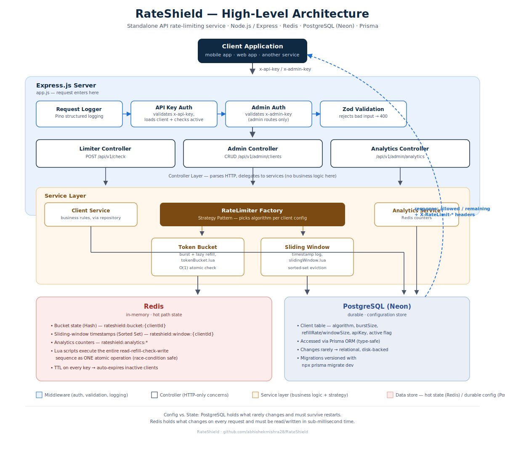
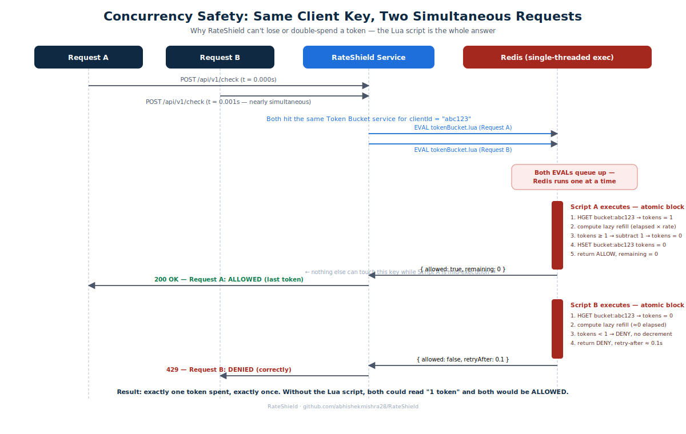

# 🛡️ RateShield

**Standalone API Rate Limiting Service**

RateShield is a production-grade backend service that sits in front of APIs and protects them from abuse, excessive traffic, bot attacks, and rate-limit violations. Built with clean architecture principles and designed for scalability.

[](https://github.com/abhishekmishra28/RateShield/actions/workflows/ci.yml)

---

## 🏗️ Architecture

```
┌─────────────────────────────────────────────────────────────┐
│                     Client Request                          │
└──────────────────────────┬──────────────────────────────────┘
                           │
                           ▼
┌─────────────────────────────────────────────────────────────┐
│                    Express.js Server                        │
│  ┌─────────────┐  ┌──────────────┐  ┌───────────────────┐   │
│  │  Request    │  │  API Key     │  │  Admin Auth       │   │
│  │  Logger     │→ │  Auth        │  │  Middleware       │   │
│  │  (Pino)     │  │  Middleware  │  │  (x-admin-key)    │   │
│  └─────────────┘  └──────┬───────┘  └───────────────────┘   │
│                          │                                  │
│                          ▼                                  │
│  ┌──────────────────────────────────────────────────────┐   │
│  │                  Controller Layer                    │   │
│  │  ┌────────────┐  ┌──────────┐  ┌─────────────────┐   │   │
│  │  │  Limiter   │  │  Admin   │  │  Analytics      │   │   │
│  │  │  Controller│  │  CRUD    │  │  Controller     │   │   │
│  │  └─────┬──────┘  └──────────┘  └─────────────────┘   │   │
│  └────────┼─────────────────────────────────────────────┘   │
│           │                                                 │
│           ▼                                                 │
│  ┌──────────────────────────────────────────────────────┐   │
│  │                   Service Layer                      │   │
│  │  ┌──────────────────────────────────────────────┐    │   │
│  │  │        RateLimiter Factory (Strategy)        │    │   │
│  │  │  ┌───────────────┐  ┌────────────────────┐   │    │   │
│  │  │  │  Token Bucket │  │  Sliding Window    │   │    │   │
│  │  │  │  Strategy     │  │  Strategy          │   │    │   │
│  │  │  └───────┬───────┘  └────────┬───────────┘   │    │   │
│  │  └──────────┼───────────────────┼───────────────┘    │   │
│  └─────────────┼───────────────────┼────────────────────┘   │
│                │                   │                        │
└────────────────┼───────────────────┼────────────────────────┘
                 │                   │
                 ▼                   ▼
┌────────────────────────┐  ┌─────────────────────────────────┐
│      Redis             │  │      PostgreSQL (Neon)          │
│  ┌──────────────────┐  │  │  ┌───────────────────────────┐  │
│  │ Bucket State     │  │  │  │  Client Configuration     │  │
│  │ Window State     │  │  │  │  (Prisma ORM)             │  │
│  │ Analytics        │  │  │  └───────────────────────────┘  │
│  │ (Lua Scripts)    │  │  │                                 │
│  └──────────────────┘  │  │                                 │
└────────────────────────┘  └─────────────────────────────────┘
```
---
<h2>📊 Visual Architecture</h2>

<h3>System Architecture</h3>

<p align="center">
  
</p>

<h3>Concurrency Flow</h3>

<p align="center">
  
</p>
---

## 🚀 Tech Stack

| **Category**          | **Technology**             |
|-----------------------|----------------------------|
| **Runtime**           | Node.js                    |
| **Framework**         | Express.js 5               |
| **Database**          | PostgreSQL (Neon)          |
| **ORM**               | Prisma                     |
| **Cache / State**     | Redis 7                    |
| **Validation**        | Zod                        |
| **Logging**           | Pino                       |
| **API Documentation** | Swagger / OpenAPI 3.0      |
| **Testing**           | Jest + Supertest           |
| **Load Testing**      | k6                         |
| **Containerization**  | Docker + Docker Compose    |
| **CI/CD**             | GitHub Actions             |

---

## 📁 Project Structure

```
RateShield/
├── .github/workflows/
│   └── ci.yml                    # GitHub Actions CI pipeline
├── prisma/
│   ├── schema.prisma             # Database schema
│   └── migrations/               # Database migrations
├── src/
│   ├── config/
│   │   ├── env.config.js         # Zod-validated environment config
│   │   ├── logger.config.js      # Pino structured logger
│   │   ├── prisma.js             # Prisma client singleton
│   │   ├── redis.config.js       # Redis client with reconnection
│   │   └── swagger.config.js     # OpenAPI 3.0 specification
│   ├── controllers/
│   │   ├── admin.controller.js   # Client CRUD endpoints
│   │   ├── analytics.controller.js # Analytics endpoints
│   │   └── limiter.controller.js # Rate limit check endpoint
│   ├── middleware/
│   │   ├── adminAuth.middleware.js    # Admin key validation
│   │   ├── apiKeyAuth.middleware.js   # Client API key auth
│   │   ├── errorHandler.middleware.js # Global error handler
│   │   ├── requestLogger.middleware.js # HTTP request logging
│   │   └── validate.middleware.js     # Zod validation factory
│   ├── repositories/
│   │   └── client.repository.js  # Database access layer
│   ├── routes/
│   │   ├── admin.routes.js       # Admin route definitions
│   │   └── limiter.routes.js     # Rate limiter routes
│   ├── services/
│   │   ├── lua/
│   │   │   ├── tokenBucket.lua   # Atomic token bucket script
│   │   │   └── slidingWindow.lua # Atomic sliding window script
│   │   ├── analytics.service.js  # Redis analytics counters
│   │   ├── client.service.js     # Client business logic
│   │   ├── rateLimiter.strategy.js # Strategy + Factory pattern
│   │   ├── slidingWindow.service.js # Sliding window implementation
│   │   └── tokenBucket.service.js   # Token bucket implementation
│   ├── tests/
│   │   ├── integration/
│   │   │   ├── admin.test.js     # Admin API tests
│   │   │   └── limiter.test.js   # Rate limiter tests
│   │   ├── load/
│   │   │   └── rateLimitLoad.js  # k6 load test script
│   │   ├── unit/
│   │   │   ├── middleware.test.js
│   │   │   ├── rateLimiterFactory.test.js
│   │   │   ├── slidingWindow.test.js
│   │   │   ├── tokenBucket.test.js
│   │   │   └── validators.test.js
│   │   └── setup.js              # Test environment setup
│   ├── utils/
│   │   ├── errors.js             # Custom error class hierarchy
│   │   └── response.helper.js    # Consistent API response format
│   └── validators/
│       └── client.validator.js   # Zod validation schemas
├── app.js                        # Express application assembly
├── server.js                     # Server bootstrap + graceful shutdown
├── Dockerfile                    # Multi-stage production build
├── docker-compose.yml            # Full stack (App + PG + Redis)
├── jest.config.js                # Test configuration
└── package.json
```

---

## ⚡ Quick Start

### Prerequisites

- Node.js 20+
- Redis 7+
- PostgreSQL 16+ (or Neon account)

### Local Development

```bash
# 1. Clone the repository
git clone https://github.com/abhishekmishra28/RateShield.git
cd RateShield

# 2. Install dependencies
npm install

# 3. Configure environment
cp .env.example .env
# Edit .env with your DATABASE_URL, REDIS_URL, and ADMIN_API_KEY

# 4. Generate Prisma client and run migrations
npx prisma generate
npx prisma migrate dev

# 5. Start development server
npm run dev
```

### Docker (Recommended)

```bash
# Start all services (App + PostgreSQL + Redis)
docker compose up --build -d

# Run migrations inside the container
docker compose exec app npx prisma migrate deploy

# View logs
docker compose logs -f app

# Stop all services
docker compose down -v
```

---

## 📡 API Reference

### Public Endpoints

| Method | Endpoint    | Description              |
|--------|-------------|--------------------------|
| `GET`  | `/health`   | Health check             |
| `GET`  | `/api-docs` | Swagger UI documentation |

### Rate Limiter (requires `x-api-key` header)

| Method      | Endpoint        | Description      |
|-------------|-----------------|------------------|
| `POST`      | `/api/v1/check` | Check rate limit |

### Admin (requires `x-admin-key` header)


| **Method** | **Endpoint**                           | **Description**        |
|------------|----------------------------------------|------------------------|
| `POST`     | `/api/v1/admin/clients`                | Create a client        |
| `GET`      | `/api/v1/admin/clients`                | List all clients       |
| `GET`      | `/api/v1/admin/clients/:id`            | Retrieve a client      |
| `PUT`      | `/api/v1/admin/clients/:id`            | Update a client        |
| `DELETE`   | `/api/v1/admin/clients/:id`            | Delete a client        |
| `GET`      | `/api/v1/admin/analytics`              | View global analytics  |
| `GET`      | `/api/v1/admin/analytics/:clientId`    | View client analytics  |
| `DELETE`   | `/api/v1/admin/analytics/:clientId`    | Reset client analytics |

### Example: Create a Client

```bash
curl -X POST http://localhost:5000/api/v1/admin/clients \
  -H "Content-Type: application/json" \
  -H "x-admin-key: your_admin_key" \
  -d '{
    "name": "Mobile App",
    "algorithm": "TOKEN_BUCKET",
    "burstSize": 20,
    "refillRate": 10
  }'
```

### Example: Check Rate Limit

```bash
curl -X POST http://localhost:5000/api/v1/check \
  -H "x-api-key: <client-api-key-from-create-response>"
```

**Response (200 – Allowed):**
```json
{
  "success": true,
  "data": {
    "allowed": true,
    "remaining": 19,
    "limit": 20,
    "algorithm": "TOKEN_BUCKET"
  }
}
```

**Response (429 – Rate Limited):**
```json
{
  "success": false,
  "error": {
    "code": "RATE_LIMITED",
    "message": "Rate limit exceeded"
  }
}
```
Headers: `Retry-After: 2`, `X-RateLimit-Remaining: 0`

---

## 🔑 Redis Key Design

| **Purpose**      | **Key Pattern**                         | **Data Type** | **TTL**                      |
|------------------|-----------------------------------------|---------------|------------------------------|
| Token Bucket     | `rateshield:bucket:{clientId}`          | Hash          | `2 × capacity / refillRate`  |
| Sliding Window   | `rateshield:window:{clientId}`          | Sorted Set    | `windowSize + 60s`           |
| Client Analytics | `rateshield:analytics:{clientId}:total` | Counter       | None                         |
| Global Analytics | `rateshield:analytics:global:total`     | Counter       | None                         |

---

## 🧠 Algorithms

### Token Bucket

Allows **burst traffic** up to `burstSize`, then enforces `refillRate` tokens/second. Uses **lazy refill** — tokens are calculated based on elapsed time when a request arrives.

```
Capacity: 10 tokens, Refill: 5/sec

Time 0s:  ██████████ (10 tokens)
Request:  █████████░ (9 tokens — allowed)
...
Request:  ░░░░░░░░░░ (0 tokens — DENIED, retry in 0.2s)
Time 0.2s: ░░░░░░░░░█ (1 token refilled)
```

### Sliding Window Log

Tracks **individual request timestamps** in a Redis sorted set. Removes expired entries on each check.

```
Window: 60s, Max: 100 requests

[t=0s] Request 1  → 1/100  → ALLOWED
[t=1s] Request 2  → 2/100  → ALLOWED
...
[t=30s] Request 100 → 100/100 → ALLOWED
[t=31s] Request 101 → 100/100 → DENIED (retry in 29s)
[t=60s] Window slides → oldest entries expire
```

---

## ⚡ Concurrency Safety

**Problem:** Without protection, two concurrent requests can read the same token count and both consume a token — effectively losing one count.

**Solution:** Redis Lua scripts execute atomically on the server side. The entire read-calculate-update cycle happens as a single operation, eliminating race conditions.

```lua
-- This entire block runs atomically:
local tokens = redis.call('HGET', key, 'tokens')
-- ... calculate refill ...
if tokens >= 1 then
    tokens = tokens - 1
    redis.call('HSET', key, 'tokens', tokens)
end
return { allowed, tokens }
```

---

## 🧪 Testing

```bash
# Run all tests
npm test

# Unit tests only
npm run test:unit

# Integration tests only
npm run test:integration

# Tests with coverage report
npm run test:coverage

# k6 load test (requires running server)
k6 run src/tests/load/rateLimitLoad.js --env API_KEY=your-key
```

### Expected Test Results
| **Test Suite**         | **Tests** | **Coverage Area**               |
|------------------------|-----------|---------------------------------|
| Unit: Token Bucket     | 5         | Algorithm correctness           |
| Unit: Sliding Window   | 4         | Window management               |
| Unit: Factory          | 4         | Strategy selection              |
| Unit: Validators       | 14        | Input validation                |
| Unit: Middleware       | 9         | Authentication & error handling |
| Integration: Admin     | 12        | Full CRUD lifecycle             |
| Integration: Limiter   | 7         | End-to-end rate limit flow      |

### k6 Load Test Expected Results

| **Performance Metric** | **Target**      |
|------------------------|-----------------|
| **p95 Latency**        | `< 100 ms`      |
| **Error Rate**         | `< 1%`          |
| **Throughput**         | `> 1,000 req/s` |

---

## 🐳 Docker Deployment

```bash
# Start all services
docker compose up --build -d

# Verify health
curl http://localhost:5000/health

# Run database migrations
docker compose exec app npx prisma migrate deploy

# View API documentation
open http://localhost:5000/api-docs
```

**Services:**

| **Service**        | **Port** | **Docker Image**        |
|--------------------|----------|-------------------------|
| **RateShield App** | `5000`   | Node.js 20 Alpine       |
| **PostgreSQL**     | `5432`   | PostgreSQL 16 Alpine    |
| **Redis**          | `6379`   | Redis 7 Alpine          |

---

## 🔒 Security Considerations

- **API Key Authentication**: All rate-limit check endpoints require valid `x-api-key` header
- **Admin Authorization**: Management endpoints protected by `x-admin-key` header
- **Input Validation**: All inputs validated via Zod schemas before processing
- **Error Sanitization**: Internal errors never expose stack traces or implementation details
- **Non-root Docker**: Container runs as unprivileged user
- **Inactive Client Blocking**: Suspended/inactive clients are immediately rejected

---

## 📊 Monitoring & Observability

- **Structured Logging**: Pino JSON logs with request ID correlation
- **Health Check**: `/health` endpoint for load balancer probes
- **Rate Limit Headers**: `X-RateLimit-Limit`, `X-RateLimit-Remaining`, `Retry-After`
- **Analytics API**: Real-time metrics for allowed/rejected request counts and rates
- **Docker Health Checks**: Built-in container health monitoring

---

## 🚀 Scalability

- **Stateless Application**: All state lives in Redis/PostgreSQL → horizontal scaling via multiple app instances
- **Redis Persistence**: Bucket and window state survive app restarts
- **Connection Pooling**: Prisma handles PostgreSQL connection pooling
- **Atomic Operations**: Redis Lua scripts ensure correctness under concurrent load
- **TTL-based Cleanup**: Redis keys auto-expire to prevent memory leaks

---

## 💥 Failure Scenarios

| **Scenario**               | **Expected Behavior**                                                 |
|----------------------------|-----------------------------------------------------------------------|
| **Redis Unavailable**      | Rate limit checks fail with `500 Internal Server Error` (fail-closed) |
| **PostgreSQL Unavailable** | Client lookups fail with `500 Internal Server Error`                  |
| **Invalid API Key**        | Returns `401 Unauthorized` immediately                                |
| **Inactive Client**        | Returns `401 Unauthorized` with client status information             |
| **Server Restart**         | Redis preserves rate-limiting state (when persistence is enabled)     |
| **Concurrent Requests**    | Lua scripts ensure atomic rate-limit updates and consistency          |

---

## 📜 License

ISC © [Abhishek Mishra](https://github.com/abhishekmishra28)